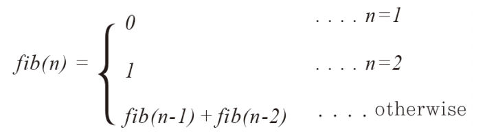

## chapter 02
### 02-1 함수의 재귀적 호출의 이해
- 재귀함수 : 함수 내에서 자기 자신을 다시 호출하는 함수
- 동일한 패턴의 반복!!
- 팩토리얼 : n!
  - n! = n * (n-1) * n-2 * ... * 2 * 1
  - n! = n * (n-1)!
```java
public class RecursiveFactorial {

    private static int factorial(int n) {
        if(n == 1) return 1; //기저 사례(BASE CASE)
        else return n * factorial(n-1);
    }

    public static void main(String[] args) {
        System.out.println(factorial(9));
    }
}
```
- 결과 : ``362880``

### 02-2 재귀의 활용
- <strong>피보나치 수열(Fibonacci sequence)</strong>
- 0, 1, 1, 2, 3, 5, 8, 11, 13, 21, 34 ....
- 앞 두개를 더해서 현재의 수를 만들어가 는 수열

```text
n번째 값을 반환하는 함수
if n == 1 
    return 1
if n == 2
    return 1
else
    return fibo(n-1) + fibo(n-2)   
```

- <strong>이진 탐색 알고리즘(재귀)</strong>
```text
1. 시작위치가 끝 위치보다 커지는 경우 -> 종료조건 
2. 탐색 범위의 중앙에 목표 값이 저장되어있는지 확인
2. 탐색 범위를 반으로 줄여서 다시 탐색 시작
```
```text
binarySearch(){
  if(시작인덱스 > 끝인덱스) 탐색 실패
  
  중간인덱스 = (시작인덱스 + 끝인덱스) /2
  if(배열[중간인덱스] == 목표값):
    탐색된 타겟의 인덱스 값 반환
  
  else if 배열[중간인덱스] < 목표값 :
    시작인덱스 = 중간인덱스
    binarySearch()
  else: 
    끝인덱스 = 중간인덱스
    binarySearch()
}
```

### 02-3 하노이 타워
```text
1. 작은 원반 n - 1 개를 중간 지점으로 이동
2. 맨 아래 원반 1개를 목표 지점으로 이동
3. 작은 원반 n - 1 개를 목표 지점으로 이동
```
```text
1. 출발 지점, 중간 지점, 목표 지점, 원반
2. 탈출 조건 원반의 개수가 1개일 때
```


